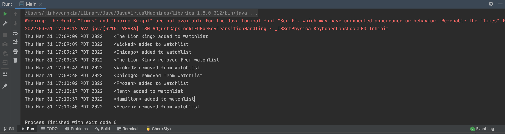

# Musical watchlist application

## Overview

A Musical watchlist application allows the user to add musicals that they want to watch. The user can also add details
about the musical such as theater, ticket price in detail when adding the musical. If the user have watched the musical
or the user no longer wants to watch it anymore, the user can delete a musical from the watch list whenever they want.
The user could also search the musical by its title. People who love watching musicals can use this application to keep
track on the musicals that are currently performing or about to perform in the future along with the theater and ticket
price. As a musical lover, I always wrote down my own list of musicals that I want to watch. I know that it is hard to
keep track on multiple musicals with various theaters and the various ticket prices. So I thought this project would be
practical for me.

## User Stories

### Phase 1

- As a user, I want to be able to add a musical to my watch list
- As a user, I want to be able to view the list of the titles of the musicals in my watch list before removing one of
  the musicals
- As a user, I want to be able to select a musical in my watch list and view the theater and the ticket price in detail
- As a user, I want to be able to delete a musical from my watch list
- As a user, I want to be able to search the musical by its title

### Phase 2

- As a user, I want to be able to save my watchlist to file
- As a user, I want to be able to be able to load my watchlist from file

### Phase 4: Task 2

### Phase 4: Task 3

- I wrote everything related to GUI in one class in WatchListUI class. If I had more time, I would factor out the Panel
  related fields and methods into one additional Panel class.
- Instead of using require clause, I would add more exceptions to handle those cases and make the program more robust.